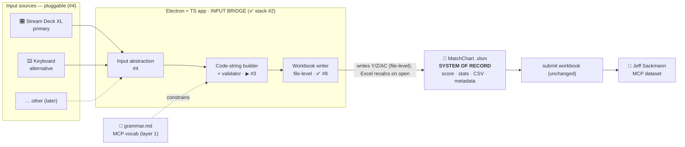
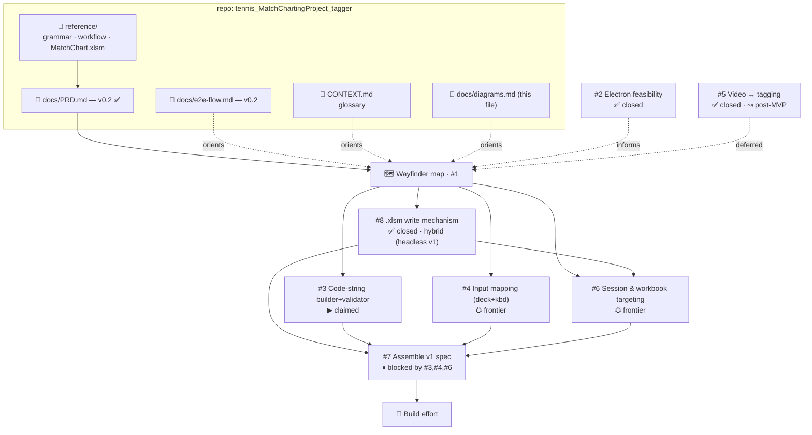

# Diagrams — source of truth

Two views that center the project and index the handoffs. Version-controlled here; mirrored on the
tldraw canvas (`MCP | Match Charting Project.tldraw` → **Diagram** page) for whiteboarding. This file
is authoritative — update it when components or tickets change.

**Model (PRD v0.2):** the app is an **input bridge** — it captures pluggable input, builds a validated
MCP code string, and **writes it into the MatchChart `.xlsm`**, which stays the system of record.

Legend: **✅ locked/done** · **▶ in flight** · **⛭ frontier (takeable)** · **⏸ blocked** · **↝ deferred**.

---

## View 1 — System components (data flow)

**Layers:** layer 1 = MCP vocab (locked, grammar doc) · layer 3 = input mapping (#4, pluggable). The
old layer-2 superset model is dropped — the workbook is the model.

---

## View 2 — Artifact & handoff map

**Frontier (takeable now):** #3 (claimed), #4, #6.
