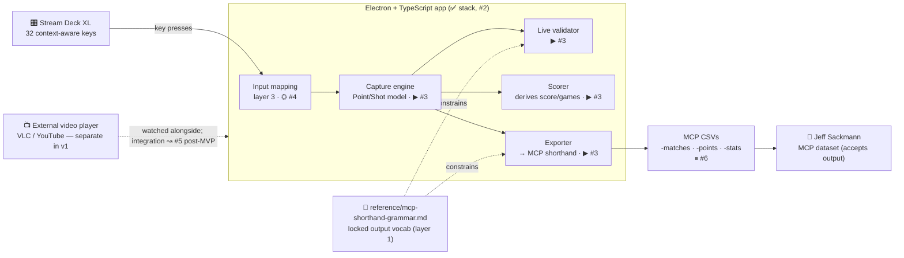
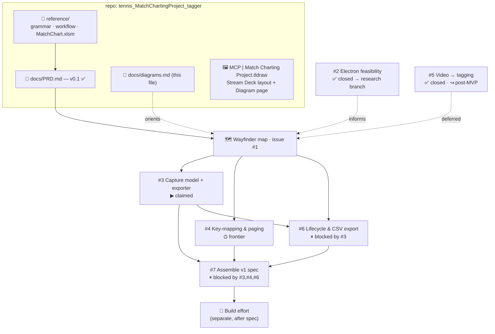

# Diagrams — source of truth

Two views that center the project and index the handoffs. Version-controlled here; mirrored on the
tldraw canvas (`MCP | Match Charting Project.tldraw` → **Diagram** page) for whiteboarding. Keep this
file authoritative; update it when components or tickets change.

Legend: **✅ locked/done** · **▶ in flight** · **⛭ frontier (takeable)** · **⏸ blocked** · **↝ deferred/post-MVP**.

---

## View 1 — System components (product data flow)

What the tool *is* and how data flows from the operator to the MCP dataset. Each box names the
ticket/doc that owns it.

**Layers (schema spine):** layer 1 = MCP shorthand (locked, the grammar doc) · layer 2 = superset
capture model (#3) · layer 3 = customizable input mapping (#4).

---

## View 2 — Artifact & handoff map

Where everything lives and how the planning hands off, ending in a build-ready spec.

**Handoff rule (wayfinder):** decisions resolve one ticket at a time; #7 is assembled *last* from the
resolved tickets, then handed to a build effort. The PRD sits above the map as product context.
